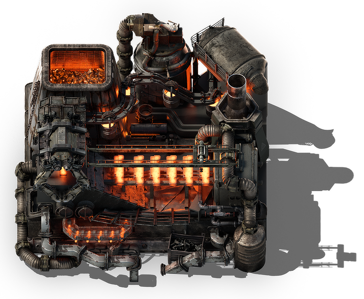

<details class="mf-entity-entry">
<mf-entity-summary icon="buildings/advanced-foundry-icon.png">Advanced foundry</mf-entity-summary>



<table>
    <tr>
        <th>Default name</th>
        <td>"advanced-foundry"</td>
    </tr>
    <tr>
        <th>Default type</th>
        <td>"assembling-machine"</td>
    </tr>
    <tr>
        <th>Size</th>
        <td>8x8</td>
    </tr>
    <tr>
        <th>Frozen graphics</th>
        <td>no</td>
    </tr>
    <tr>
        <th>Sounds</th>
        <td>yes</td>
    </tr>
    <tr>
        <th>Credits</th>
        <td><a href="https://www.figma.com/proto/y1IQG08ZG2jIeJ5sTyF4MP/Factorio-Buildings" target="_blank">Hurricane</a></td>
    </tr>
    <tr>
        <th>License</th>
        <td><a href="https://creativecommons.org/licenses/by/4.0/" target="_blank">CC BY</a></td>
    </tr>
</table>

### Minimal example

```lua
local AdvancedfoundryFactory = require(MF.buildings .. "Advancedfoundry")
local Advancedfoundry = AdvancedfoundryFactory()

Advancedfoundry.EntityBuilder:new()
    :baseProductivity(0.5)
    :allowProductivity(true)
    :apply({
        crafting_categories = table.deepcopy(data.raw["assembling-machine"]["foundry"].crafting_categories),
    })

Advancedfoundry.ItemBuilder:new():apply()

Advancedfoundry.RecipeBuilder:new()
    :ingredients({
        { type = "item", name = "iron-plate", amount = 100 }
    })
    :apply({
        category = "metallurgy-or-assembling"
    })

Advancedfoundry.TechnologyBuilder:new()
    :prerequisites({ "automation-science-pack" })
    :count(500)
    :ingredients({ { "automation-science-pack", 1 } })
    :time(60)
    :apply()
```

### Usage example

```lua
local AdvancedfoundryFactory = require(MF.buildings .. "Advancedfoundry")
local Advancedfoundry = AdvancedfoundryFactory()

Advancedfoundry.EntityBuilder:new()
    :baseProductivity(0.5)
    :allowProductivity(true)
    :apply({
        crafting_categories = table.deepcopy(data.raw["assembling-machine"]["foundry"].crafting_categories),
        crafting_speed = 8,
        energy_usage = "4MW"
    })

Advancedfoundry.ItemBuilder:new():apply()

Advancedfoundry.RecipeBuilder:new()
    :ingredients({
        { type = "item", name = "iron-plate", amount = 100 }
    })
    :apply({
        category = "metallurgy-or-assembling"
    })

Advancedfoundry.TechnologyBuilder:new()
    :prerequisites({ "automation-science-pack" })
    :count(500)
    :ingredients({ { "automation-science-pack", 1 } })
    :time(60)
    :apply()
```

</details>