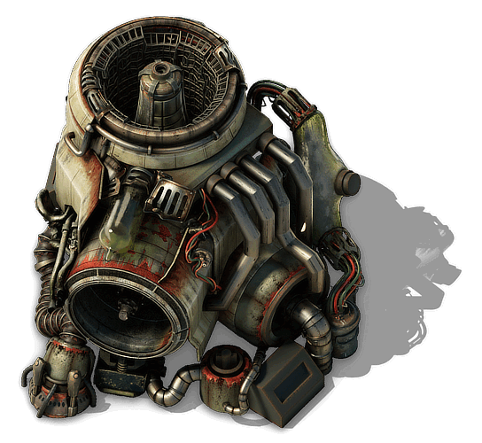

<details class="mf-entity-entry">
<mf-entity-summary icon="buildings/atom-forge-icon.png">Atom forge</mf-entity-summary>



<table>
    <tr>
        <th>Default name</th>
        <td>"atom-forge"</td>
    </tr>
    <tr>
        <th>Default type</th>
        <td>"assembling-machine"</td>
    </tr>
    <tr>
        <th>Size</th>
        <td>6x6</td>
    </tr>
    <tr>
        <th>Frozen graphics</th>
        <td>no</td>
    </tr>
    <tr>
        <th>Sounds</th>
        <td>yes</td>
    </tr>
    <tr>
        <th>Credits</th>
        <td><a href="https://www.figma.com/proto/y1IQG08ZG2jIeJ5sTyF4MP/Factorio-Buildings" target="_blank">Hurricane</a> / Pixabay (Sounds)</td>
    </tr>
    <tr>
        <th>License</th>
        <td><a href="https://creativecommons.org/licenses/by/4.0/" target="_blank">CC BY</a> / <a href="https://pixabay.com/service/license-summary/" target="_blank">Pixabay License</a></td>
    </tr>
</table>

### Minimal example

```lua
local AtomForgeFactory = require(MF.buildings .. "AtomForge")
local AtomForge = AtomForgeFactory()

AtomForge.EntityBuilder:new():apply()

AtomForge.ItemBuilder:new():apply()

AtomForge.RecipeBuilder:new()
    :ingredients({})
    :apply()

AtomForge.TechnologyBuilder:new()
    :prerequisites({ "automation-science-pack" })
    :ingredients({ { "automation-science-pack", 1 } })
    :count(500)
    :time(60)
    :apply()
```

### Usage example

```lua
local AtomForgeFactory = require(MF.buildings .. "AtomForge")
local AtomForge = AtomForgeFactory()

AtomForge.EntityBuilder:new()
    :burnerEnergySource({
        fuel_categories = nil, -- Remove default before adding new
        emissions_per_minute = { pollution = nil }
    })
    :apply({
        crafting_categories = table.deepcopy(data.raw["assembling-machine"]["assembling-machine-3"].crafting_categories),
        crafting_speed = 8,
        energy_usage = "4MW",
        energy_source = {
            fuel_categories = { "nuclear", "fusion" }
        }
    })

AtomForge.ItemBuilder:new():apply()

AtomForge.RecipeBuilder:new()
    :ingredients({
        { type = "item", name = "stone-brick", amount = 40 }
    })
    :apply()

AtomForge.TechnologyBuilder:new()
    :prerequisites({ "automation-science-pack" })
    :ingredients({ { "automation-science-pack", 1 } })
    :count(500)
    :time(60)
    :apply()
```

</details>