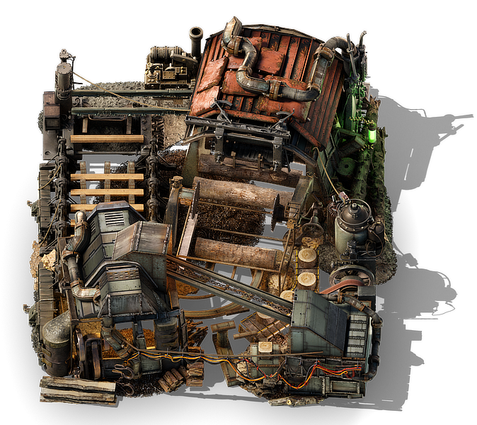

<details class="mf-entity-entry">
<mf-entity-summary icon="buildings/lumber-mill-icon.png">Lumber mill</mf-entity-summary>



<table>
    <tr>
        <th>Default name</th>
        <td>"lumber-mill"</td>
    </tr>
    <tr>
        <th>Default type</th>
        <td>"assembling-machine"</td>
    </tr>
    <tr>
        <th>Size</th>
        <td>8x8</td>
    </tr>
    <tr>
        <th>Frozen graphics</th>
        <td>no</td>
    </tr>
    <tr>
        <th>Sounds</th>
        <td>yes</td>
    </tr>
    <tr>
        <th>Credits</th>
        <td><a href="https://www.figma.com/proto/y1IQG08ZG2jIeJ5sTyF4MP/Factorio-Buildings" target="_blank">Hurricane</a> (graphics) / Pixabay (Sounds)</td>
    </tr>
    <tr>
        <th>License</th>
        <td><a href="https://creativecommons.org/licenses/by/4.0/" target="_blank">CC BY</a> / <a href="https://pixabay.com/service/license-summary/" target="_blank">Pixabay License</a></td>
    </tr>
</table>

### Minimal example

```lua
local LumberMillFactory = require(MF.buildings .. "LumberMill")
local LumberMill = LumberMillFactory()

LumberMill.EntityBuilder:new():apply()

LumberMill.ItemBuilder:new():apply()

LumberMill.RecipeBuilder:new()
    :ingredients({})
    :apply()
    
LumberMill.TechnologyBuilder:new()
    :prerequisites({ "automation-science-pack" })
    :ingredients({ { "automation-science-pack", 1 } })
    :count(500)
    :time(60)
    :apply()
```

### Usage example

```lua
local LumberMillFactory = require(MF.buildings .. "LumberMill")
local LumberMill = LumberMillFactory()

data:extend({
    {
        type = "recipe-category",
        name = "wood-processing-or-assembling"
    }
})

LumberMill.EntityBuilder:new()
    :burnerEnergySource({ emissions_per_minute = { noise = 50 } })
    :baseProductivity(0.5)
    :apply({
        crafting_categories = { "wood-processing-or-assembling" },
        crafting_speed = 4,
        energy_usage = "1000kW",
    })

LumberMill.ItemBuilder:new()
    :apply({
        default_import_location = "lignumis"
    })

LumberMill.RecipeBuilder:new()
    :ingredients({
        { type = "item", name = "stone-brick",               amount = 40 },
        { type = "item", name = "lumber",                    amount = 100 },
        { type = "item", name = "wooden-gear-wheel",         amount = 100 },
        { type = "item", name = "copper-plate",              amount = 60 },
        { type = "item", name = "burner-assembling-machine", amount = 5 }
    })
    :apply({
        category = "wood-processing-or-assembling"
    })

LumberMill.TechnologyBuilder:new()
    :prerequisites({ "wood-science-pack" })
    :ingredients({ { "wood-science-pack", 1 } })
    :count(500)
    :time(60)
    :apply()
```

</details>